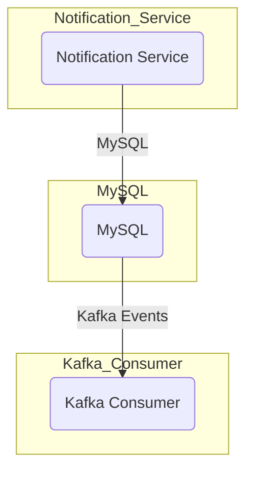

# In standalone:



# Together with sensor service:
```mermaid
graph TD
  subgraph Frontend
    A(Frontend)
  end

  subgraph API_Gateway
    B(API Gateway)
  end

  subgraph Kafka_Broker
    C(Kafka Broker)
  end

  subgraph Sensor_Service
    D(Sensor Service)
  end

  subgraph Notification_Service
    E(Notification Service)
  end

  A -->|GraphQL| B
  B -->|Kafka Events| C
  C -->|Sensor Data| D
  D -->|Threshold Check| E
  E -->|Raise Flag| C
  ```
